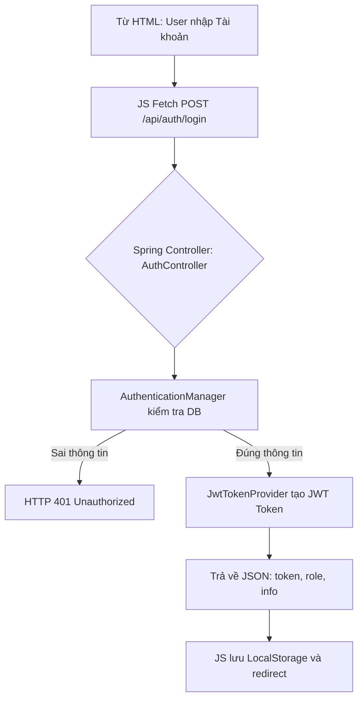

# 📑 SPECS: NCKH Backend (Java Spring Boot + SQL Server)

## 1. Executive Summary
Hệ thống NCKH (Nghiên cứu khoa học) chuyển đổi từ tĩnh sang Web App. Sử dụng **Java Spring Boot 3** làm REST API Server, kết nối với dữ liệu trên **Microsoft SQL Server**. Frontend HTML tĩnh gọi API thông qua chuẩn **JWT Authentication**.

## 2. Database Design (SQL Server - T-SQL)
Sơ đồ cơ sở dữ liệu dự kiến trên SSMS:

**Table: `Roles`**
- `id` (PK, INT) (1: Admin, 2: GiangVien, 3: SinhVien)
- `role_name` (NVARCHAR(50), UNIQUE)

**Table: `Users`**
- `id` (PK, INT, IDENTITY(1,1))
- `username` (VARCHAR(50), UNIQUE)
- `password_hash` (VARCHAR(255))
- `full_name` (NVARCHAR(100))
- `role_id` (FK -> `Roles.id`)
- `created_at` (DATETIME DEFAULT GETDATE())

**Table: `Topics` (Đề tài NCKH)**
- `id` (PK, INT, IDENTITY(1,1))
- `title` (NVARCHAR(255))
- `description` (NVARCHAR(MAX))
- `author_id` (FK -> `Users.id`)
- `status` (VARCHAR(50)) -- Draft, Submitted, Approved, Rejected
- `created_at` (DATETIME DEFAULT GETDATE())

**Table: `Articles` (Bài báo)**
- `id` (PK, INT, IDENTITY(1,1))
- `title` (NVARCHAR(255))
- `journal_name` (NVARCHAR(150))
- `publish_year` (INT)
- `author_id` (FK -> `Users.id`)
- `document_url` (VARCHAR(255))

## 3. Logic Flowchart (Luồng Đăng nhập Hệ thống Java)

## 4. Tech Stack Chuyên Sâu
- **Framework:** Spring Boot 3.2+
- **Database Access:** Spring Data JPA + Hibernate.
- **Security:** Spring Boot Starter Security.
- **Java Bean:** Lombok (`@Data`, `@NoArgsConstructor`).
- **JDBC Driver:** `mssql-jdbc`
- **Tạo Cấu trúc DB:** Execute SQL Script trực tiếp vào SSMS thay vì dùng Liquibase/Flyway ở giai đoạn đầu để tăng tính chủ động.

## 5. Build Checklist
- Java 25 JDK.
- SQL Server Management Studio (SSMS).
- IDEA (IntelliJ) cấu hình Maven.
